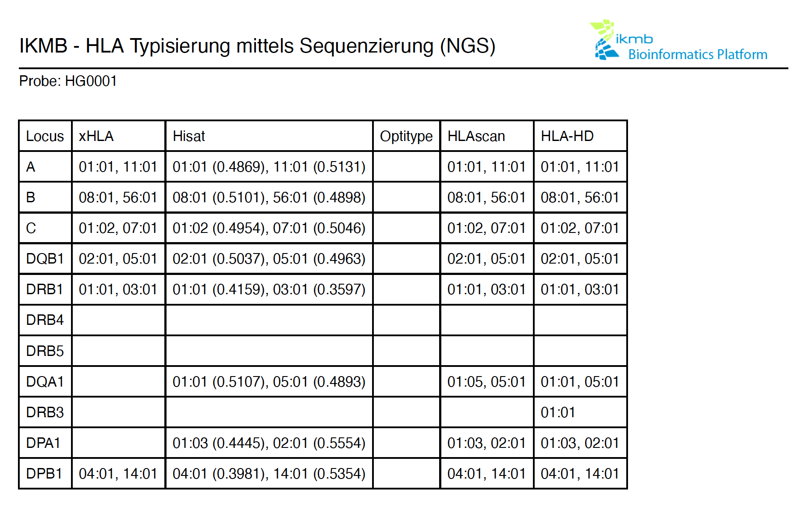

# Outputs 

## Folder structure

Results are split by patient and therein by sample(s). Each sample folder contains the raw outputs from the various typing tools. Usable reports are stored under `Reports` in JSON and PDF format. 

### PDF Report



### JSON

The JSON format can be used to programmatically parse and transform the result data. An example follows below:

```
{
	"sample": "HG0001",
	"calls": {
		"A": {
			"xHLA": ["01:01", "11:01"],
			"Hisat": ["11:01 (0.5131)", "01:01 (0.4869)"],
			"Optitype": [],
			"HLAscan": ["01:01", "11:01"],
			"HLA-HD": ["11:01", "01:01"]
		},
		"B": {
			"xHLA": ["08:01", "56:01"],
			"Hisat": ["08:01 (0.5101)", "56:01 (0.4898)"],
			"Optitype": [],
			"HLAscan": ["08:01", "56:01"],
			"HLA-HD": ["56:01", "08:01"]
		},
		"C": {
			"xHLA": ["01:02", "07:01"],
			"Hisat": ["07:01 (0.5046)", "01:02 (0.4954)"],
			"Optitype": [],
			"HLAscan": ["07:01", "01:02"],
			"HLA-HD": ["01:02", "07:01"]
		},
		"DQB1": {
			"xHLA": ["02:01", "05:01"],
			"Hisat": ["02:01 (0.5037)", "05:01 (0.4963)"],
			"Optitype": [],
			"HLAscan": ["05:01", "02:01"],
			"HLA-HD": ["02:01", "05:01"]
		},
		"DRB1": {
			"xHLA": ["01:01", "03:01"],
			"Hisat": ["01:01 (0.4159)", "03:01 (0.3597)"],
			"Optitype": [],
			"HLAscan": ["03:01", "01:01"],
			"HLA-HD": ["03:01", "01:01"]
		},
		"DRB4": {
			"xHLA": [],
			"Hisat": [],
			"Optitype": [],
			"HLAscan": [],
			"HLA-HD": ["", ""]
		},
		"DRB5": {
			"xHLA": [],
			"Hisat": [],
			"Optitype": [],
			"HLAscan": ["", ""],
			"HLA-HD": ["", ""]
		},
		"DQA1": {
			"xHLA": [],
			"Hisat": ["01:01 (0.5107)", "05:01 (0.4893)"],
			"Optitype": [],
			"HLAscan": ["01:05", "05:01"],
			"HLA-HD": ["01:01", "05:01"]
		},
		"DRB3": {
			"xHLA": [],
			"Hisat": [],
			"Optitype": [],
			"HLAscan": [],
			"HLA-HD": ["01:01", "-"]
		},
		"DPA1": {
			"xHLA": [],
			"Hisat": ["02:01 (0.5554)", "01:03 (0.4445)"],
			"Optitype": [],
			"HLAscan": ["01:03", "02:01"],
			"HLA-HD": ["01:03", "02:01"]
		},
		"DPB1": {
			"xHLA": ["04:01", "14:01"],
			"Hisat": ["14:01 (0.5354)", "04:01 (0.3981)"],
			"Optitype": [],
			"HLAscan": ["04:01", "14:01"],
			"HLA-HD": ["14:01", "04:01"]
		}
	},
	"pipeline_version": "1.4",
	"date": "12.07.2023"
}

```