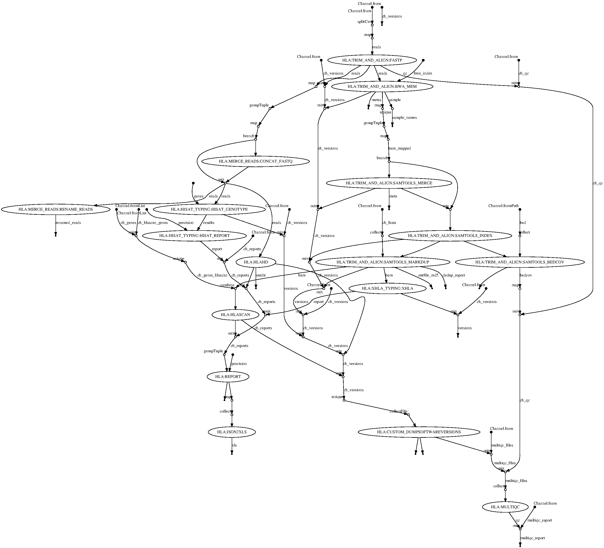

# Pipeline structure

This pipeline performs HLA typing from NGS short-read data. This data can come from either targetted capture approaches, exome-sequencing or whole-genome shotgun sequencing. 
Note however that high-coverage exome as well as whole genome data will result in very long run times in certain tools (specifically: hisat-genotype). 

## Processing chain(s)

Tools supported by this pipeline have different requirements for their input. This is handled automatically, however, and includes steps such as mapping reads against a bespoke mapping index based on the HLA region on chromosome 6 
as well as merging reads across lanes (bam as well as fastq). The relevant results from this are then passed to the respective tools for analysis. 

hisat-genotype: trim reads and merge across lanes to create FastQ input
optitype: trim reads and merge across lanes to create FastQ input
HLA-HD: trim reads and merge across lanes to create FastQ input
xHLA: map reads against chromosome 6 and merge across lanes to create BAM input
HLAscan: map reads against chromosome 6 and merge across lanes to create BAM input

## Workflow graph

